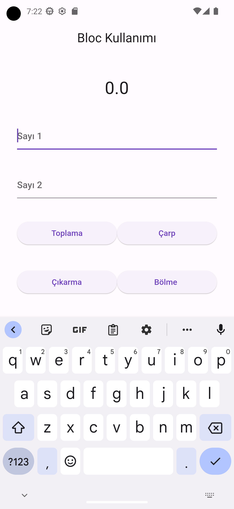
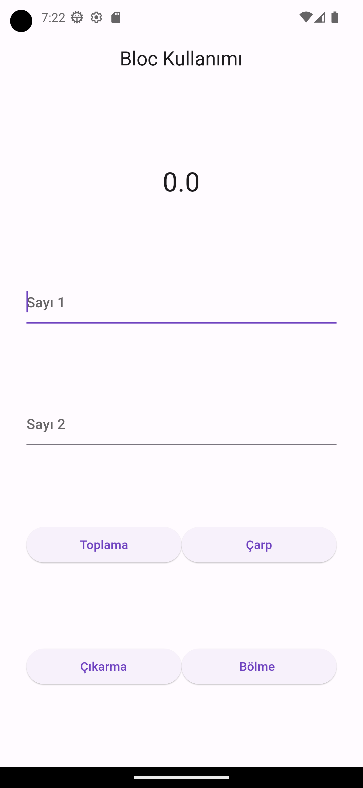

# Bloc Cubit kullanım örneği

Merhaba👋 Bloc Pattern Cubit ile ilgili çok basit bir örnek yaptım , bu örneğin amacı bloc cubit yapısını merak edenler ve öğrenmek isteyenler için basit bir örnek oluşturmak. uygulamada bol yorum satırı kullandım keyifli projeler

### Kullanılan Paket

''' flutter_bloc: ^8.1.3 
'''

### Bazı Görseller

